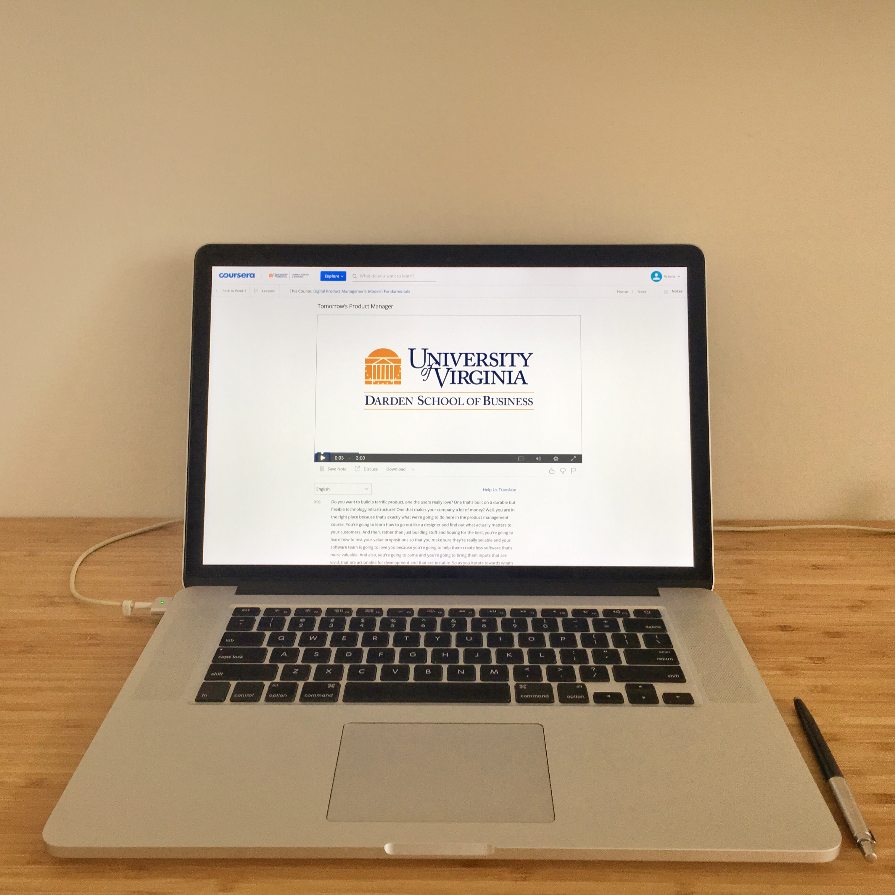

Well, I decided to learn more about being a product manager. It's always fun to complain where there is no PM in the workplace, but I wanted to see what was really missing, and why a PM was needed. So I decided to learn this top`ic by myself, I had some free time to spare, so why not?

Let's start with Coursera. It has university-based content. I honestly felt like I was going back in time and sitting in one of the lectures in my college, in the middle of the desert (yeah, a story for another time). I don't mean that it was a bad thing, it was just how the material was presented.

The author was presenting models, conducting interviews with other product managers and showing slides. All of these are important, it just felt like you had no idea what you should do next. When the course was done, what should be the next step for me to become a product manager? What were the practical applications of all that I had learned?

Anyway, it was a good overview course for a more academic understanding of this job. Which is not bad - it gives you another perspective of the profession and enlarges your vocabulary.
