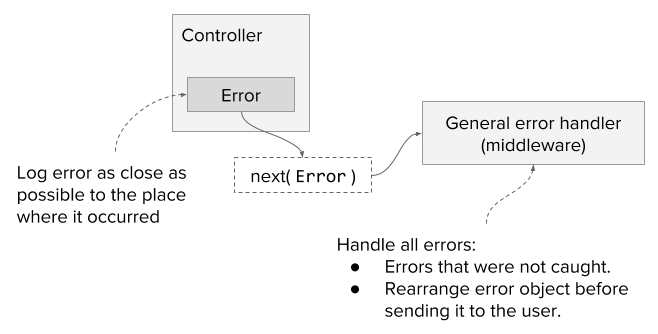

Errors will occur no matter what, but I hope that’s not stopping you from writing code because it doesn't matter if you stop - someone else will continue the tradition instead :) So the only proper solution is to be prepared and to handle errors in the right way.

<!-- end -->

What is the right way, you may ask? It's great that you asked. The right way of handling any error is to make sure it is logged and can be found in the postmortem analysis. So how do we do this? The general approach will include the following rules:

1. Each error should be logged as close to the source as possible.
    * If an error occurred in an ajax request to the server, it should be logged in the catch() method of the controller - in most cases, this will be the most relevant scenario.
    * If it occurred in some general method, then it depends on what part of the code was wrapped in the try catch.
1. In most cases, the user shouldn't be allowed to see the full technical information about the error, the code line, exact error description from the database, etc. This information should be logged and obfuscated before sending to the user.
1. In a case where an error hasn't been caught - then it should be handled in the middleware. This is needed to ensure that the application will stay alive.

Let's review these rules one by one.

#### Log error as close as possible to the source

We're logging errors for only one reason - to be able to fix them later. It means that we'll somehow need to understand what happened. For example, one useful piece of information will be the filename where the error has been logged. We often forget about it, thinking that the error stack will handle it, but unfortunately, it's not true.

In a complex application, when you're requesting data from different sources and relying on multiple 3rd party libraries for an error stack trace, it could be that it only includes information from inside such libraries. In this case, you will need to investigate it somehow. This task will be much harder if you're logging your errors in the middleware only. In such scenarios, you'll spend long hours trying to find out: in which controller this error occurred.

#### The user shouldn't be allowed to see internal technical information about the error

You can't expect the user to open a bug ticket on an error that occurred in the application, right? This is because the user usually has better things to do - for example, being annoyed and never using your solution again! This is why we use logs - in order not to have to ask the user, "What happened?".

However, we need some way to handle this problem and inform him that something strange has happened. Here we need to think, what is expected from us? If there is a problem, the user needs to know what he can do in order to fix that. It shouldn't be some purely technical information with an example of a buggy SQL expression. It could be something like "Reload the page" or "Try later".

The way to ensure that this is the only data, which the user will receive, is to handle it in the middleware. Create a new object, with filtered data that has no sensitive information, and only then send it to the user. In this way, you'll ensure that you'll have all the information about the incident.

#### In case an error hasn't been caught - then it should be handled in the middleware

There will be unhandled errors. From time to time we'll forget to put logs and `catch()` methods in the right places. In this case, we'll log the error in the middleware right before informing the user. This is the least preferable scenario, but it’s still better than crushing the server.



#### Now let's talk code - how we'll implement it

First, I'm going to assume that we're working with the `express` framework, so all examples will be based on that. Second, the logging system. I'm not going to explain in this post about what package to use or how to implement it. The assumption is that there is some library that is handling it and writing logs into the file or providing them via stdout so that some tool could aggregate it.

We'll start with controllers, that are requesting data from some service. In the example below, we have `projects` service, that's fetching data from somewhere. In the case of an error, we'll log it and then provide it to the next middleware to handle the response to the user. I also wrapped it in the Boom object, this will indicate that the error has been processed and will need only to be returned to the user.

```javascript
const getAllProjects = (req, res, next) => {
    debug(`Get all projects (user id ${req.authSession.userId})`);
    projects
        .getAll({
            userId: req.authSession.userId,
        })
        .then((projects) => {
            res.json(projects);
        })
        .catch((err) => {
            logger(err);
            next(Boom.badRequest(err));
        });
};
```

Next, we need to write the middleware, that will handle the response to the user. Here we'll handle 2 optional scenarios:

1. An error has been caught in the controller, logged and has been sent down the line wrapped in the Boom object.
1. An error hasn't been caught and needs to be logged.

```javascript
app.use((err, req, res, next) => {
    const boomErr = (() => {
        if (!err.isBoom) {
            logger(err);
            return Boom.boomify(err, { statusCode: 500 });
        }
        return err;
    })();
    // Hide message of server errors
    if (boomErr.output.payload.statusCode >= 500) {
      boomErr.output.payload.message = boomErr.output.payload.error;
    }

    res.status(boomErr.output.statusCode).send(boomErr.output.payload);
});
```

This is the basic approach that I use for error handling in `node.js`. Keep in mind that in the real world scenario you'll need to take into account the real issues. For example, if you use swagger you probably will need to check it in your middleware for errors. Or, probably you would like to hide error messages only in production, but not in the development.