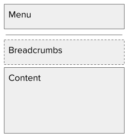
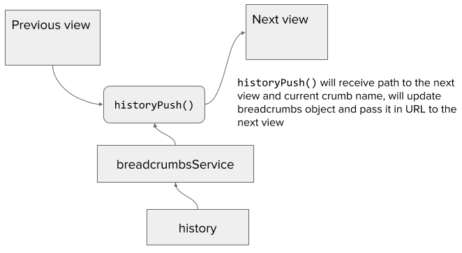

Breadcrumbs can be displayed in different ways. Usually, this is solved in a naive way - if a user enters the page where a certain product is displayed, then he will see breadcrumbs from categories that are hierarchically dependent on each other. This is reasonably easy to implement because it is static information. The more complex requirement is to display a history of the changes, where we'll see not only the previous pages but also the filters that have been applied to them.

<!-- end -->

Let's start by defining a use-case. It will be a simple one, as we don't need to make it complicated. I'm building an application that is dealing with some kinds of deliveries. There are "parcels", that have packages and items. They are dependent on each other and they can be presented in the following way:

1. Parcels
    * Parcels: delivered
1. Single parcel
1. Package
1. List of items
    * List of items: red
1. Single item


As you can see from the list, the parcels and items can be sorted. Packages are presented in a simple list and you just need to find the right one.

Now, we need to define functionality for our breadcrumbs that will define whether we implement them or not. So the requirements are:

1. Breadcrumbs list should be activated when the user enters a page that allows breadcrumbs.
1. If the user enters a page with no breadcrumbs, then the breadcrumbs data should be lost.
1. Each crumb should also display filters that have been applied on the list that the user saw on the previous page.
    * The user should be able to click on the breadcrumb and go back to the page with the same filtered (or sorted) list.
1. The user should be able to send a link to the current page, with breadcrumbs, to a coworker and he will see exactly the same breadcrumbs history.

**Routing structure**

Ok, let's start by defining the routings that will be used for displaying our pages. Each one of the entities has its own page and can be accessed independently, so routing needs to reflect this. This is a fairly easy part since it's relying on the basic functionality of any routing:

```javascript
<Router history={history}>
  <Route path='/' component={AppView}>
    <IndexRoute component={MainView} />
    <Route path='parcels' component={ParcelsView} />
    <Route path='parcels/:parcelId' component={SingleParcelView} />
    <Route path='packages' component={PackagesView} />
    <Route path='packages/:packageId' component={SinglePackageView} />
    <Route path='items' component={ItemsView} />
    <Route path='items/:itemId' component={SingleItemView} />
  </Route>
</Router>
```

As you can see above I'm assuming there are already defined views and that I can incorporate them into my router. I will define each one of them later. First, let's see what will be the template for each view. It will be something simple, but nevertheless, let's first define it. At the top, we'll have a menu that is permanently placed there. Under the menu is a placeholder for breadcrumbs - they could be shown or not, it depends on the page. After that, we have page content.



**Passing breadcrumbs between views**

The next problem will be how to pass breadcrumbs between views. We need a unified strategy for that. There should be only one service that has this logic and it will only need to provide a clear API.

First, the whole logic will be based on the history object that can receive path and query params in order to create a URL for the next view. I will piggyback on this functionality, but I can't use it as is, because before being able to use it, we need to wrap it in our service logic:



The API of the history object is quite simple. In order to change the URL, we need to push its definition into history:

```javascript
history.push({
  pathname: '/some-url',
  search: '?query=list-of-breadcrumbs',
})
```

Now we need to define how these breadcrumbs need to be stored in the URL. Since it will be a list of objects, the obvious choice will be JSON, but we need to encode it, in order to store it in the URL, and it could be a quite long string, which could create a problem in the future. Honestly, there is no easy workaround for this problem. What we can do for now is to convert the JSON string into the base64 format and gain some space; not much, but it's better than nothing.

```javascript
import _get from 'lodash/get';
import _isString from 'lodash/isString';
import history from '../history';

const breadCrumbsSequence = [
    {
        path: /\/parcels$/,
        defaultName: 'Parcels',
    },
    {
        path: /\/parcels\/[^/\s]+$/,
        defaultName: 'Single parcel',
    },
    {
        path: /\/packages\/[^/\s]+$/,
        // Here I'm disabling default name in order to test what will be shown instead
        // (should be a path)
        // defaultName: 'Single package',
    },
    {
        path: /\/items\/[^/\s]+$/,
        defaultName: 'Single item',
    },
];

const QUERY_CRUMB_PROP = 'c';

const encodeCrumbs = (crumbs) => {
    return encodeURI(btoa(crumbs));
};

const decodeCrumbs = (str) => {
    return atob(decodeURI(str));
};

export const getCrumbs = () => {
    const location = history.getCurrentLocation();
    const queryData = _get(location, `query.${QUERY_CRUMB_PROP}`);
    const decodedStr = queryData && decodeCrumbs(queryData);
    let crumbs = null;
    try {
        crumbs = JSON.parse(decodedStr);
    } catch (e) {
        crumbs = [];
    }
    return crumbs;
};

/*
 * @param data {object}
 * @param data.pathname {string}
 * @param data.currentCrumbName {string}
 */
export const historyPush = (data) => {
    const location = history.getCurrentLocation();
    const crumbs = getCrumbs();
    const nextCrumb = {
        p: location.pathname + location.search,
    };
    // If user provided crumb name we'll use it
    if (_isString(data.currentCrumbName) && data.currentCrumbName !== '') {
        nextCrumb.n = data.currentCrumbName;
    } else {
        const pathObj = breadCrumbsSequence.find(item => item.path.test(location.pathname));
        // If there is no name we'll use default name
        if (pathObj && pathObj.defaultName) {
            nextCrumb.n = pathObj.defaultName;
        } else if (pathObj) {
            // If there is no default name we'll use pathname
            nextCrumb.n = location.pathname;
        }
    }
    crumbs.push(nextCrumb);
    const str = JSON.stringify(crumbs);
    history.push({
        pathname: data.pathname,
        search: `?${QUERY_CRUMB_PROP}=${encodeCrumbs(str)}`,
    });
};
```

Good, now we can store breadcrumbs in the URL and have access to them. The next step will be to define the way of displaying them. Since I have been using bootstrap CSS in almost every project, I will use design and CSS classes from there.

This time the only thing we need to do is to fetch breadcrumbs from the URL, if there is something to display, then render it, and if an array is empty, then render nothing.

```javascript
import React from 'react';
import _get from 'lodash/get';
import { Link } from 'react-router';
import PropTypes from 'prop-types';
import { getCrumbs } from '../../services/breadcrumbs';

class Breadcrumbs extends React.PureComponent {
    state = {
        crumbs: [],
    };

    componentDidMount() {
        const crumbs = getCrumbs();
        this.setState({ crumbs });
    }

    renderLastCrumb() {
        const name = _get(this.props.current, 'name');
        if (name) {
            return (
                <li
                    className='breadcrumb-item active'
                    aria-current='page'
                >
                    {name}
                </li>
            );
        }
        return null;
    }

    render() {
        const { crumbs } = this.state;

        if (crumbs.length === 0) {
            return null;
        }

        return (
            <nav aria-label='breadcrumb'>
                <ol className='breadcrumb'>
                    {crumbs.map((crumb, index) => (
                        <li
                            className='breadcrumb-item'
                            key={`crumb-${index}`}
                        >
                            <Link to={crumb.p}>
                                {crumb.n}
                            </Link>
                        </li>
                    ))}
                    {this.renderLastCrumb()}
                </ol>
            </nav>
        );
    }
}

Breadcrumbs.propTypes = {
    current: PropTypes.shape({
        name: PropTypes.string,
    }),
};

Breadcrumbs.defaultProps = {
    current: null,
};

export default Breadcrumbs;
```

This is it, all the major parts are here. The full example is stored in my GitHub and you can check it out https://github.com/artemdemo/breadcrumbs