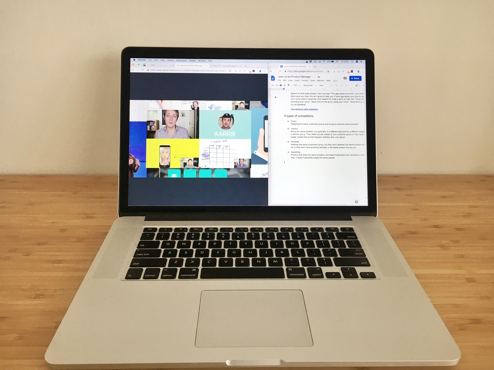

It would be a long journey. Really, there were 17 sections, each one included from 3 to 26 videos. Each video was from 3, up to 16 minutes. This all added up to a very long course. On the other hand, what did you expect? To learn the profession in one sitting? Sadly it's not the case.

Of course, even after that course, you wouldn't, by any means, be a good product manager. What you would lack would be real-world experience, but at least you would have a good start if you were dedicated and willing to learn.

The course was based on practical examples and a lot of methods for product analysis. I started it because it was important for me to understand what were the challenges of product managers. Currently, I'm not planning to change jobs, but I always aim to better understand the professional landscape and such courses look like a good opportunity to do so.
