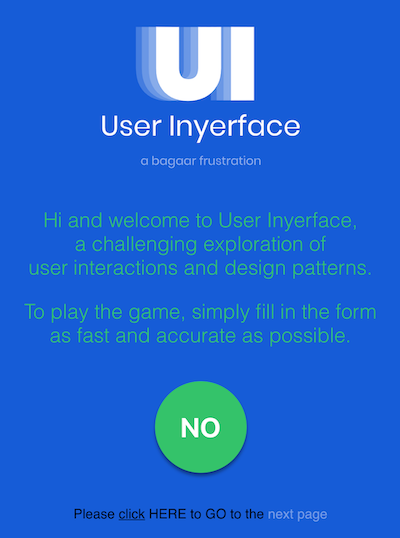
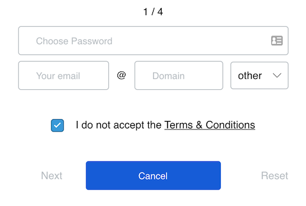

"Let's play a game" I will give you a link to a form that is designed against all UI and UX norms and you'll need to fill it as fast as possible. You can't imagine how hard it could be when the designer deliberately is going against all codes that the industry agrees upon.

<!-- end -->

It all starts with the first page - you simply need to get past it and start filling the form. What should you click in order to get through?

I wouldn't spoil it to you. You should try to figure it out by yourself, but how refreshing is to see the big green "NO" button in the middle of the screen, right? It's so tempting to click on it even that the text is saying that you wouldn't achieve the desired effect.

Or let's take a look at the following form:

Do you know the best part about it? No, if you only glanced at this form you couldn't know. Please, take a moment.

Do you see? They selected the "Cancel" button as major action! If you click on it, you'll be returned to the previous step. Wow, that's harsh.

Take another look. Do you see the placeholders in the inputs? Well, they're not placeholders it's predefined text! You need first manually to delete it and only then you'll be able to add desired value.

And who in the hell will ask the user to enter each part of the email separately? I never saw anything like that! That's crazy.

Ok, that's all, if you want to see and try it by yourself ~~and feel miserable~~ follow this link: https://userinyerface.com/ But I warned you, it wouldn't be easy :)
