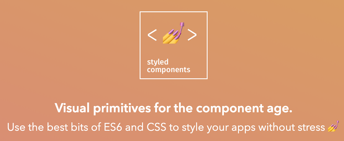

The whole logic of styled-components can be described in one "feature request": "Let's manage CSS in js alongside with component core code". The logic behind it is sort of obvious - it will give us the dynamic of js inside of CSS and we'll be able to treat styling as part of component code and not store it in a separate file.

The idea is promising, now let's see what are some of the edge cases. And why is that? Because nothing is ideal in the world.

<!-- end -->



## Referencing existing component

Let's say we need to reference the style of sibling component status. The simple example will be - custom radio button. I want to change the CSS of a sibling component based on whether Input is checked or not. In this case, I definitely need the class name. But I don't have it, because styled-components will generate class later.

I can solve it by reference to the component itself. The library will later replace it with the generated class name.

```js
const RadioMark = styled.span`
    display: inline-block;
    position: relative;
    border: 1px solid #777777;
    width: 14px;
    height: 14px;
    left: 0;
    border-radius: 50%;
    margin-right: 10px;
    vertical-align: middle;
`;

const RadioInput = styled.input`
    position: absolute;
    visibility: hidden;
    display: none;
    &:checked + ${RadioMark} {
        &::after {
            content: '';
            display: block;
            width: 10px;
            height: 10px;
            border-radius: 50%;
            background-color: blue;
            left: 2px;
            top: 15%;
            position: absolute;
        }
    }
`;
```

Live example:

<iframe src="https://codesandbox.io/embed/radio-button-getgl?fontsize=14" title="Radio Button" allow="geolocation; microphone; camera; midi; vr; accelerometer; gyroscope; payment; ambient-light-sensor; encrypted-media; usb" style="width:100%; height:500px; border:0; border-radius: 4px; overflow:hidden;" sandbox="allow-modals allow-forms allow-popups allow-scripts allow-same-origin"></iframe>

<br />
<br />

## Update attributes via styled-components API

Another interesting example is - how to change the attribute of the component. We certainly can do it directly via component props. But what about changing styling directly? I would like to define every style change in one place.

Another reason for this approach is often style changes. You see, styled-components will create a separate class for each change and will dynamically shuffle them when needed. It's not always desired behavior and could affect performance. A much better solution will be to update an attribute directly.

```js
const Logo = styled.div.attrs(props => ({
    style: {
        backgroundImage: `url(${selectLogo(props)})`,
    },
}))`
    width: 30px;
    height: 30px;
    background-size: contain;
    background-repeat: no-repeat;
    display: inline-block;
`;
```

## Wrap existing component in styled, but do not pass all props

Some components don't like to receive props that are not defined. If you have access to the source code of such components, then you can decide whether you want to change this behavior or not. But often it's not the case especially if this component came from a 3rd party library.

The easy solution will be to filter out such properties. We can do it simply with the destructuring method of ES6. You just need to explicitly define which values are not desired and use the rest.

```js
// <Link /> is expecting certain list of props.
// It will print a warning for unknown props, therefore I'm filtering it out.

const StyledLink = styled(({ warning, danger, general, theme, ...rest }) => <Link {...rest} />)`
    ${props => styleGen(props)}
`;
```
