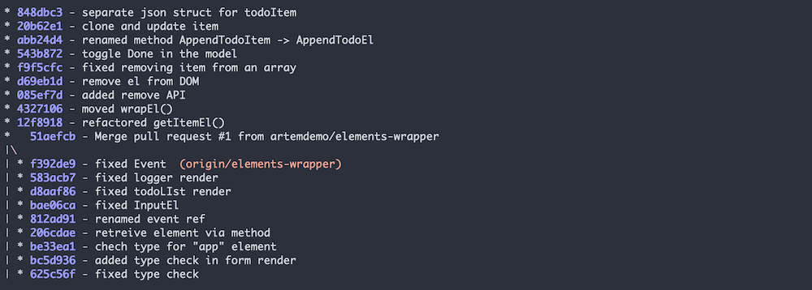
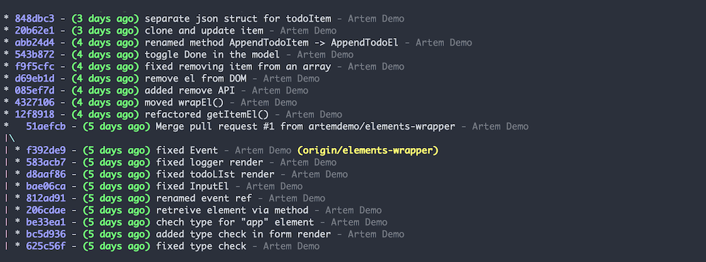

I'm using a lot of git features via CLI. Mainly it's rebasing, committing and pushing new changes to the repository. I know that most editors have UI solutions for these commands, but I never liked it and honestly don't see any reason to change my habits. Stubborn you say? Probably. Don't know.

<!-- end -->

So if you, like me, and want to try to use CLI to manage git repo - I want to share with you the shortcuts that I regularly use at work. Because, some commands are just too long to remember, but still CLI is the best :)

We'll add these commands to the global git config file. For Linux and mac global git configuration is here: ~/.gitconfig

I'm not going to explain everything you can configure in gitconfig. Frankly, I don't know all the options. Only the minimum that needed. And the whole purpose of this post is to remind to future me, what are the commands that I usually use. So, you're welcome, Artem.

Let's start. There are three sections in gitconfig, that I use:

* alias
  * Here you'll add CLI shortcuts
* user
  * Your main email and user name
* core
  * Your default editor for commits and rebasing

##[alias]

This is the most interesting section. Your git shortcuts. Your magic.

First, basic commands. The whole purpose of them is to save some typing. Very simple.

```bash
c = checkout
aa = add --all
s = status
cm = commit -m
ca = commit --amend
```

Branches managing and rebasing. These commands I use most often.

```bash
# list of available branches
# will be displayed name and when happened last change
b = "!git for-each-ref --sort='-committerdate' --format='%(color:green)%(committerdate:relative)%(color:reset)%09%(refname)' refs/heads | sed -e 's-refs/heads/--'"

# safely delete current branch
# will change to "master", fetch changes and attempt to safely delete last branch
bd = !"git c master && git fetch && git pull origin master && git branch -d $(git rev-parse --abbrev-ref @{-1})"

# same as previous command,
# but will force delete last branch
bDD = !"git c master && git fetch && git pull origin master && git branch -D $(git rev-parse --abbrev-ref @{-1})"

# interactively rebase current branch on master
rom = !"git fetch && git rebase -i origin/master"
```

Commits history. Your logs. There is an easy command git log, that will print list of commits, but it wouldn't be so user-friendly. Therefore I created some commands that I use regularly:

```bash
# list of logs, in one line, with branch names and commit ids
lg1 = log --oneline --decorate --graph --format=format:'%C(bold blue)%h%C(reset) - %C(white)%s%C(reset) %C(yellow)%d%C(reset)'
```

The result will look like this:



```bash
# same as previous, but also includes commit author and when it was added
lg2 = log --graph --abbrev-commit --decorate --date=relative --format=format:'%C(bold blue)%h%C(reset) - %C(bold green)(%ar)%C(reset) %C(white)%s%C(reset)  %C(dim white)- %an%C(reset)%C(bold yellow)%d%C(reset)'
```

The result will be:



And the default command for even shorter version of this shortcut:

```bash
# default command
lg = !"git lg1"
```

## [user]

```bash
email = you@mail.com
name = Your Name
```

Nothing to add here. You're defining here default email and user name for your commits. Easy.

## [core]

```bash
editor = vim
```

Your editor of choice. Should I say that vim should be installed on your system? You know. If you expect me to be so explicit, then probably you're in the wrong profession, buddy. Other than that, love you deeply :-*
