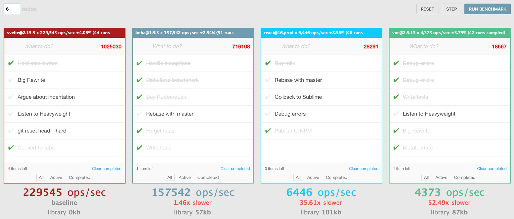
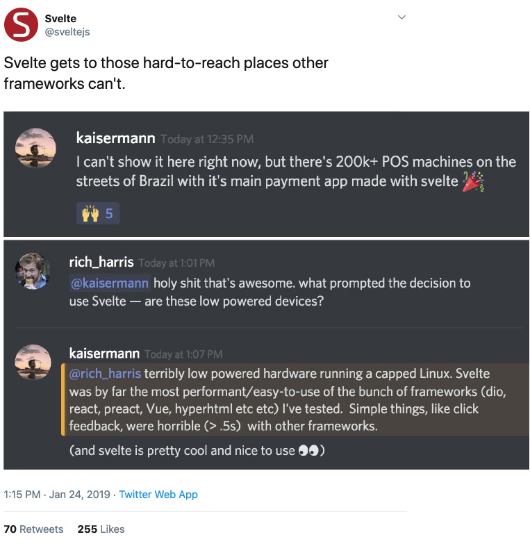

Yeah, I know, another library. But that's okay, we'll go through all of them and we'll find the best one for each project. Or at least this is something that we should do as responsible developers.

<!-- end -->

I heard about this library during the front-end conference that I attended a year ago. The funny part is that it was the first time I heard about this library. Strange, since I always try to stay in the loop and check new solutions that pop up in the market, but Svelte somehow flew under my radar.

I must say, this first talk about [Svelte](https://svelte.dev/) was very interesting. Rich Harris (author of the library) found a unique feature proposition that most modern frameworks lack. You know, honestly, most of them are doing the same thing, just naming it differently, which is not the case with Svelte.

The unique proposition of Svelte is that it's tiny and crazy fast. The performance is so much better than any other framework out there, that it's almost painful to compare Svelte to any other library. This is the benchmark comparison for some libraries:

You see that it's 35 times faster than React! Ok, now let's take a deep breath and see what's going on here.

First, even if it's that fast it usually doesn't matter. Because in most cases we're dealing with simple cases of UI, like display forms, simple UX interactions, little animation here and there and this is it. This performance boost wouldn't be visible in any modern browser.

Another thing is the size. As you can see, there is no library size for Svelte and the reason is that it came with a built-in compiler that will take only what is needed for each component. Which is great, since we don't want to bring with us overhead of unused methods when the developer asked for only specific ones.

But the devil is in the details, I said that compiler will take necessary functions for each component. It means that theoretically, you can create so many components that additional code will exceed standard library size. It's a good point, but irrelevant, for two reasons:

1. You need to create a lot of components (something like more than 500 of them).
1. You always can split the code and load what is necessary for the given view (by the way, you always should do it).

Now, let's talk about the use cases. Obviously, the community of the popular frameworks (like React or Angular) is much larger and if you choose to use "big guns" you'll get a lot of perks along the way - tested solutions for various problems, open-source components, etc. Svelte is young and its community is not filled with lots of ready to go solutions, therefore it can't compete in this field and it doesn't need to.

You should decide to choose Svelte, when performance and size really matter.

For example, when you're developing an application for low power devices. For instance in Brazil they have portable POS systems, that looks like this:

In this case, you simply can't use a mainstream framework. It will work, but the user experience will suffer. You'll need either to write the whole system in vanilla js and hope that you'll be able to pull it or to use a really lightweight framework optimized for low memory footprint like Svelte. And the results are very good:

So, that is my two cents about svelte and why you should take a look at it. It is always nice to be aware of different solutions in the market, so you could take one of them from the shelves in time of need.
