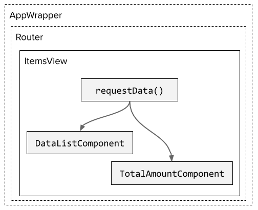

Ok, first of all I'm assuming you know what Redux is and already used it in one of your projects. Now, after we established that, let's move on. I always prefer to be clear in my assumptions and intentions. It makes life much easier :)

<!-- end -->

Now let's define the background for the next steps. First, Redux is only state management. If you need to do some async stuff, like ajax requests or any other promise/timeout based logic - you need to do it by yourself, it's not related directly to Redux. It means that if you want to store your server response in the Redux state, you need to define how it will be done. Furtenitally, the community has already provided us with solutions. I personally worked with the following two:

* [redux-saga](https://github.com/redux-saga/redux-saga/)
* [redux-thunk](https://github.com/reduxjs/redux-thunk)

The first one (sagas) I liked much better than the second one. Very elegant architecture solution (which uses redux middleware under the hood). And a chance to use generators, which is cool. But now I'm saying let's not overcomplicate things.

I'm not saying that the tool is not good. Quite the opposite - I think that we should use the right tools for the right situation.

Redux is a global state, it meant to be used by the whole app. Therefore it makes sense to store data there, only if it should be available for different components of the app. But if there is only one component that will consume a certain response from the server… why bother? We could keep redux free of this data.

In addition, there are a number of problems related to the global state:

* Since the state is part of the redux, we need to use actions each time we update it. It means that the request cycle is working independently from the context where this request was activated (hence, the parent component). This makes it hard to know exactly when a request is finished and do something with the result. For example, after fetching the data from the server we could be required:
    * Request another thing using some data from the previous request.
    * Display something if there was an error (in addition to default functionality).
* By always following the redux-state pattern we tend to put simple request results into the global state by default, even if this data will be used by a very specific component on the unique page.
* Let's say you have a list of items on a certain page. This list should be reloaded each time the user enters the page. You're using redux and storing data in the global state. It means, that you need to remember to clear the global state before a user is leaving the page. Otherwise, each time when a user enters the page he will see the previous list (while the app will load a new list from the server). Usually, it's not desired, when you required to fetch new data every time.

But of course redux is very useful for certain requirements. We just need to pay attention and not over-architect things. The good examples of redux usage are:

* Store something that is used more than in one place on the page or in multiple pages.
* Something that shouldn't be refreshed frequently and we can use stored data when the user next time opens the same page.

Some examples from the "real world":

* User data
    * authorization data
    * user settings
* App configurations (that app requests at the start).
* Display global events, such as notifications. Each component should be able to dispatch an action that will trigger a notification.

There are probably more. I listed the obvious once.

Now, if we're not going to use Redux, then how we will provide data to the consumers? Easy, I suggest that we need to request data only in the component that will use it.

For example, there is a component view, that displays a list of items. This list should be requested each time the user opens the view (Why? Glad you asked, because, in this example, the state is managed in the server only). Then the most obvious solution will be to make a request in the view itself and provide data to its all children.

We can follow the same rules for structuring our code as for the redux and store request functions in separate files. I mean separate from the components that will use these requests. This approach is even preferable:

* We could be required to use this request multiple times.
* Let's not forget about tests and if you split your logic - it will be easier to test.

So, what will be the bottom line? There is no silver bullet. I'm sorry, but no, there is none. We still do not have a universal answer that will fit every case. Redux is great, but first, we need to see, whether it is suitable for our situation. Do not try to fit the single solution, you have, to every problem you have. Let's try to find the best approach for the current case.
