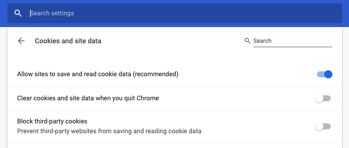
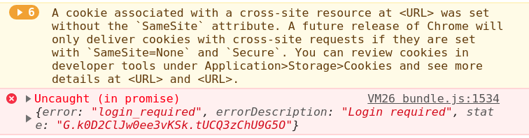

Sorry, but documentation of auth0 is not the best source of knowledge on how to use auth0. Not something that you expect to happen, right? Official documentation is okay if you need to understand only a basic usage, but if you need more than that, you pretty much on your own. At least it's my experience with this service. Especially for not so popular topic of "renewing auth0 token for SPA (Single Page Application)". So let's talk about exactly that.

<!-- end -->

First, let's understand why we need to renew. It's related to, whether you're using relatively short expiration time for your token. If you are, which, by the way, will make your app more secure, then you will want to renew token if your app is in active usage. This will make the user experience much more pleasant, so he wouldn't need to re-login each time. So the idea is legit, now the question is how to implement it.

I will start with a description of the expected flow for silent token renewal. By the way, this flow is not obvious at all. And auth0 could've done a better job of explaining it. Now I found these steps only in one of their community forums. Here there are:

1. User login to the application for the first time.
1. When the initial tokens expire the client makes another request to auth0 in order to obtain a new token.

Ok, that's great and the first step is even easy to implement. But what about the second one? How it should work and how to implement it? Let's talk about exactly that.

## Auth0 silent token renewal

Before we'll dive into code example, I want to establish some vocabulary. Auth0 uses different tokens in its lifecycle: access token, refresh token, ID token and some others. It looks like the most relevant are access token and refresh token - the first one we use in order to get access to the API and the second just has the right name. Let's look at the definition, provided by auth0 itself:

* access token - a credential that can be used by an application to access an API.
* refresh token - contains the information required to obtain a new Access Token or ID Token.

So which one we need in the renew flow? Looks like the second one is the obvious choice. But it's wrong. The funny thing is that we need neither of them in order to renew existing token for our SPA %) Crazy world.

I want to emphasize once more - I'm talking about the SPA lifecycle. My app will interact with auth0 API directly. If you have a different situation, then probably your solution will be different. Are we good? Now we can continue.

The first step will be to login. We need to start from this basic step in order to initialize the main SDK object with all credentials in place. Without it, we can't proceed to renewal.

```js
// Initialize auth0 instance.
// http://auth0.github.io/auth0.js/WebAuth.html
webAuth = new auth0js.WebAuth({
        domain,
        clientID,
        redirectUri,
        audience,
        responseType,
        scope,
});

// Kick in authorization with auth0.
// https://auth0.com/docs/libraries/auth0js/v9#webauth-authorize-
webAuth.authorize();
```

Starting token renew:

```js
/**
 * Renew authorization token
 * @param options {object}
 * @returns {Promise<any>}
 */
export const renewAuth = (options = {}) => new Promise((resolve, reject) => {
    const _options = Object.assign({
        audience: authProps.audience,
        redirectUri: `${appUrl}/silent.html`,
        usePostMessage: true,
    }, options);
    // Executes a silent authentication transaction under the hood
    // in order to fetch a new tokens for the current session.
    // @link http://auth0.github.io/auth0.js/global.html#renewAuth
    webAuth.renewAuth(_options, (err, result) => {
        if (err || _get(result, 'error')) {
            return reject(err || result);
        }
        if (result && result.accessToken && result.idToken) {
            const token = getTokenFromResult(result);
            return resolve(token);
        }
        const errorText = 'Ambiguous response from auth0';
        return reject(new Error(errorText));
    });
});
```

And here is `silent.html` file:

```html
<!doctype html>
<html>
    <head>
        <meta charset="utf-8">
        <script src="https://cdn.auth0.com/js/auth0/9.11/auth0.min.js"></script>
        <script>
            var appUrlFromConfig = '<%= htmlWebpackPlugin.options.appUrl %>';
            var appUrl = appUrlFromConfig ? appUrlFromConfig : window.location.origin;

            var webAuth = new auth0.WebAuth({
                domain: '<%= htmlWebpackPlugin.options.auth0Domain %>',
                clientID: '<%= htmlWebpackPlugin.options.auth0ClientID %>',
                redirectUri: appUrl,
                audience: '<%= htmlWebpackPlugin.options.auth0Audience %>',
                responseType: '<%= htmlWebpackPlugin.options.auth0ResponseType %>',
                scope: '<%= htmlWebpackPlugin.options.auth0PartitionScope %>',
            });

            webAuth.parseHash(function(err, response) {
                // This message will be handled by auth0 in the main app
                // You can find related callback in `webAuth.renewAuth`
                parent.postMessage(err || response, appUrl);
            });
        </script>
    </head>
    <body></body>
</html>
```

This is all you need for token renewal. But there are some hidden problems with it. So let's see what are they.

## 3rd party cookies for auth0 silent token renewal

Another thing that isn't mentioned in the official documentation (or at least I don't know where it is, and I searched a lot) is the usage of the 3rd party cookies in the process of silent token renewal. In one sentence - they are required. Your browser should allow usage of such cookies. The good thing is that they are generally available in every modern browser, but there is a catch.

First, let's check what is the status of Chrome on your machine. Why Chrome? It's just the most popular browser on the planet and if you want to check it for any other browser, you'll find a way :)

You can check your setting by going to this URL chrome://settings/content/cookies - you should see something like that:



Property "Block third-party cookies" (third from the top in my case) should be disabled. For the users, that have it enabled silent token renewal will not work.

Ok, but our problems are not ending there. In the next year, Chrome will introduce a new policy for the cookies and will require to use property SameSite. In case this property is not set, again cookies will not work. Already today you can see the following warning in the browser console:

> *A cookie associated with a cross-site resource at <URL> was set without the `SameSite` attribute. A future release of Chrome will only deliver cookies with cross-site requests if they are set with `SameSite=None` and `Secure`. You can review cookies in developer tools under Application>Storage>Cookies and see more details at <URL> and <URL>.*


In Chrome console it will look like this:



Auth0 support guys are saying that they are aware of the problem and will change their code accordingly. They will need to be ready before Chrome 80, which will be rolled out in Feb 2020. In Chrome 80 all cookies, that don't have SameSite, will be ignored by the browser. 

## Conclusion

It's not an easy task to create a secured authorization system. And I believe that auth0 are trying to do their best in order to provide the best user experience they can. But I still feel that there is room for improvement. I'm talking first of all about transparency for the developers - better documentation and a better understanding of different environments.
