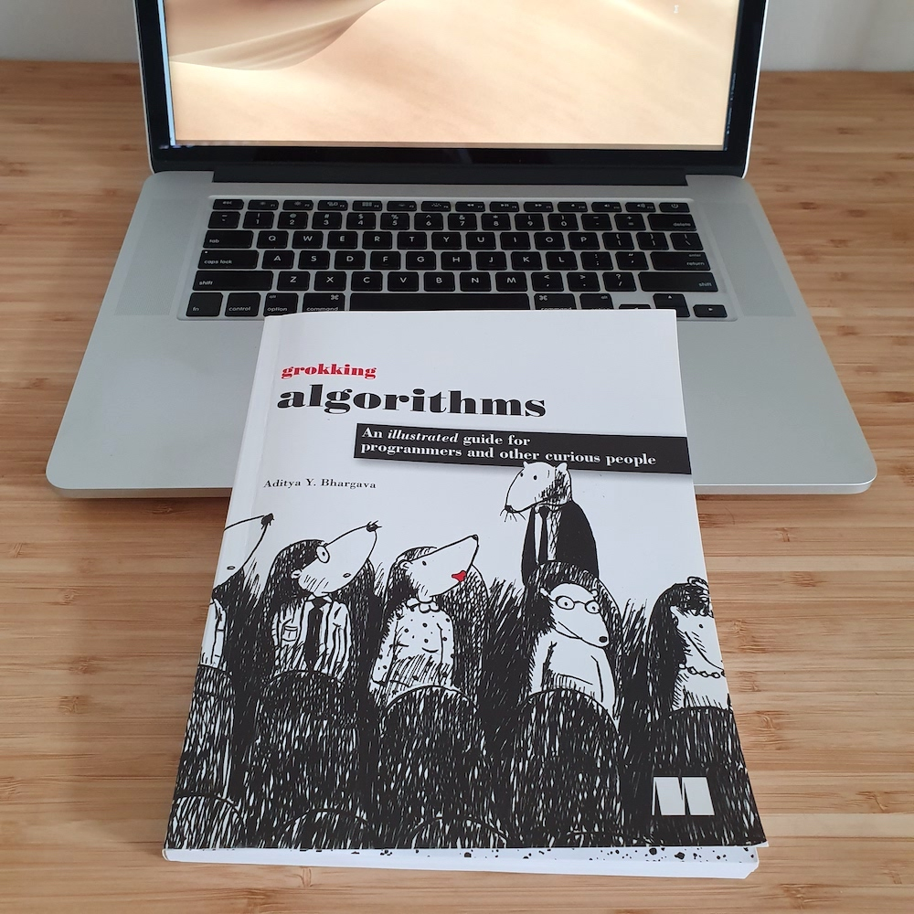

*An illustrated guide for 
programmers and other curious people.*

The book about algorithms. Not an easy topic, and not very useful in most workplaces. Ok, depends on what you're required to do. There are definitely job descriptions that require work with algorithms. But is it always the case? Certainly not.

<!-- end -->

Will knowing algorithms make you a better developer? It definitely will. Will you use it while developing a new solution for customers' e-commerce websites? I doubt it. It's possible but highly unlikely.

With all of that in mind, let's talk about the book.

I liked it. The author walked a long way to try to explain the basic algorithms in a friendly way. Which is not an easy task. You should try it if you think differently - take a friend, that is not a programmer and try to explain to him what is Quicksearch. Just kidding though. Do it only if you don't care to lose this friend :)

So what do I think about this book? It's a nice read if you want to refresh the basic concepts about algorithms. It's also nice for the students who are just starting to learn our craft. And want to get an overview in layman terms. You want to dive deep and find gold around the complicated stuff? This book is not for you. Try something else.
