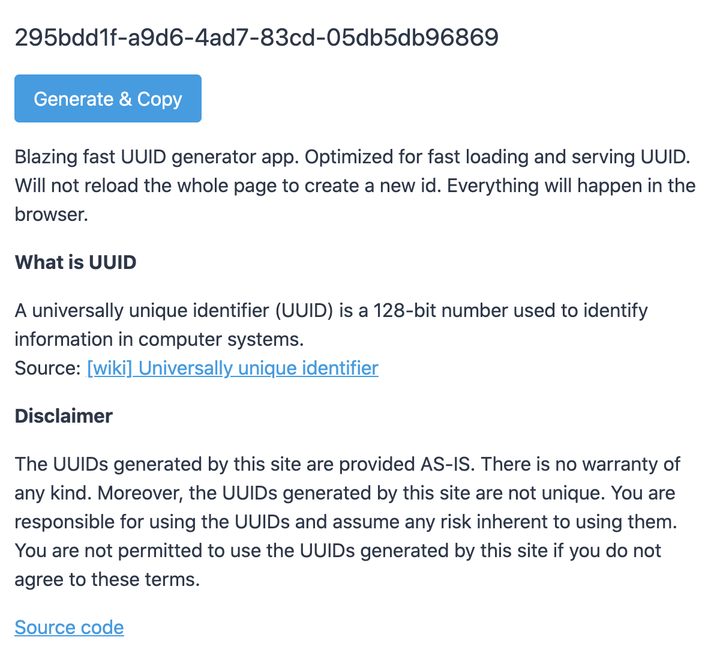

Once upon a time I needed to create UUIDs, and I needed to do it manually.
On the internet you can find a bunch of solutions, and you don't really need to invent anything.
The tech is relatively easy and there is no room for engineering innovation, so I decided to dig into user experience.

I discovered that if you're generating UUIDs manually, then obviously you're going to copy-paste them by hand.
So we can shorten the process by adding the button, which will do it for the user.
Which also eliminates the need of generating a list of IDs - you can combine this action with copying in one button.

Next step is access to the app. The user probably does not always have an internet connection,
so why not allow him to install the app on his PC. We have PWD exactly for that.

And finally the size of the app, it should be as minimal as possible and as fast as possible.
So I decided to use Svelte, since I still want comfort of the framework.
For styling, I used parts of the tailwind css framework in order to make it all look nice.

As a result js code is only 4.8 kb and css is 780 bytes, and it tools only 225 ms to first meaningful paint on my PC.

- Github: https://github.com/artemdemo/uuid-generator
- The deployed app: https://artemdemo.github.io/uuid-generator/public/
