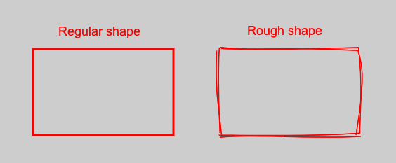

For my [ImgReview](https://imgreview.app/) app I wanted to use custom shapes with a hand-drawn, sketchy, appearance.
They look nice and could add unique touch to your work:



This hand-drawn, sketchy look can be generated with the help of a small library called rough.js.
It doesn't have additional dependencies and can be used as-is.

I'm already using Konva as my main graphic library, which makes my life easier by simplifying work with canvas.

So in order to start using rough.js I need somehow to make these two libraries work with each other.
Both of them need to use the same reference to the canvas,
but their approaches are different and may contradict (sort of).

Let's see what we get from each one of them:

- [Konva](https://github.com/konvajs/konva) provides a framework and hides a boilerplate of canvas API. I obviously want that.
- [Rough.js](https://github.com/rough-stuff/rough) helps me to create artistic patterns for my shapes, which is cool, and I want it as well.

With a straight-forward approach I can't pass a link to the canvas to rough.js and just draw whatever I want:

```js
const roughCanvas = rough.canvas(document.getElementById('myCanvas'));
```

Produced shape will be disconnected from Konva life-cycles.
I will need to add all the functionality by myself: click events, redrawing, dragging, transformation, etc.
Obviously I would prefer no to do it.

Fortunately there is an additional api provided by Konva - [Shape](https://konvajs.org/api/Konva.Shape.html) wrapper for custom shapes,
which could be useful in case you want to implement your own logic.
It provides a [sceneFunc](https://konvajs.org/api/Konva.Shape.html#sceneFunc__anchor) method, so you can draw whatever you like.

Here is an example from the official documentation:

```js
const customShape = new Konva.Shape({
  x: 5,
  y: 10,
  fill: 'red',
  // a Konva.Canvas renderer is passed into the sceneFunc function
  sceneFunc(context, shape) {
    context.beginPath();
    context.moveTo(200, 50);
    context.lineTo(420, 80);
    context.quadraticCurveTo(300, 100, 260, 170);
    context.closePath();
    // Konva specific method
    context.fillStrokeShape(shape);
  },
});
```

You need to use context, provided by sceneFunc and not extract it yourself. Otherwise results will be unexpected.

The basic idea is as follows:

1. I'm creating reference to the canvas with rough.js (`this.#roughCanvas`). I need it in order to generate the path of the shape.
1. Then in the `sceneFunc()` method I'm generating the path itself. I need it, so a path wouldn't be created each time Konva decides to call `sceneFunc()`.
1. Now rough.js doesn't allow you to pass context to it. The library works only with reference to a canvas element. Therefore, I created a separate service - `roughService`, that knows how to convert generated object to the shape.

This is an excerpt from my code:

```js
class RectRough extends Rect {
    type = EShapeTypes.RECT_ROUGH;

    readonly #roughCanvas;
    #lastDrawable;
    #isDragging: boolean = false;
    #isScaling: boolean = false;
    shape: Konva.Shape;

    constructor(props: TRectProps) {
        super(props);
        this.#roughCanvas = rough.canvas(document.querySelector(`.${SHAPES_LAYER_CLS}`));
    }

    defineShape() {
        this.shape = new Konva.Shape({
            x: this.props.x || 0,
            y: this.props.y || 0,
            width: this.props.width || 0,
            height: this.props.height || 0,
            stroke: this.props.stroke,
            strokeWidth: this.props.strokeWidth / 2,
            fill: 'transparent',
            draggable: true,
            sceneFunc: (context, shape) => {
                const selected = this.isSelected() && !this.#isDragging;
                if (selected || !this.#lastDrawable || this.#isScaling) {
                    this.#lastDrawable = this.#roughCanvas.generator.rectangle(
                        0,
                        0,
                        shape.getWidth(),
                        shape.getHeight(),
                        {
                            roughness: ROUGHNESS,
                            stroke: shape.getStroke(),
                        },
                    );
                    this.#isScaling = false;
                }
                roughService.draw(context, this.#lastDrawable);
                context.fillStrokeShape(shape);
            }
        });
    }
}
```

The full example can be found here [RectRough.ts](https://github.com/artemdemo/imgreview/blob/369c1c10ad88ed2424d671b9bd5e752332484827/srcCanvas/RectLike/RectRough.ts)
Also I didn't create roughService by myself, just borrowed implementation from rough.js.
The library [uses context under the hood](https://github.com/rough-stuff/rough/blob/fd621f41c33996d9bc9334768ed5fd29243e49a1/src/canvas.ts);
it just doesn't provide an API for that.
