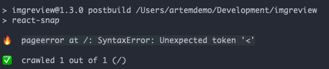

I started to experiment with [react-snap](https://github.com/stereobooster/react-snap) - a nice tool for creating pre rendered html of your SPA.
The reason is fairly simple - I want to increase visibility of [ImgReview](https://imgreview.app/) by search engines.

The installation is very easy.
Basically you need to install the package npm install react-snap, and then just change your app render point to:

```js
const rootElement = doc.getElementById('app');

if (rootElement.hasChildNodes()) {
  ReactDOM.hydrate(<App />, rootElement);
} else {
  ReactDOM.render(<App />, rootElement);
}
```

In my case though there was a problem. Pre render failed with this weird error message:

```
pageerror at /: SyntaxError: Unexpected token '<'
```



Which wasn't informative for me, since I had no idea what exactly is causing it (at first).
And then it hit me - this is an error from the browser.
It's just loading wrong files, because it's not using correct `index.html` file.

React-snap is running headless chrome under the hood, this is how it creates pre rendered html.
When there is an error during it, the only place to show it is in your terminal.
So you need to look at it as you're checking debug tools of Chrome.

So the problem was with the `index.html` file of the app.
In my case I'm placing it outside of the `/build` folder, so I need somehow to change the source folder for react-snap.
It took sometime to figure out the right configuration, since they don't have good documentation, but eventually I found the solution:

```
// package.json

"reactSnap" : {
    "source" : "./"
},
```

The cool part about "react-snap" is that it doesn't need much configuration.
Even if you use routing, it's not a problem - all your routes will be rendered into html.
