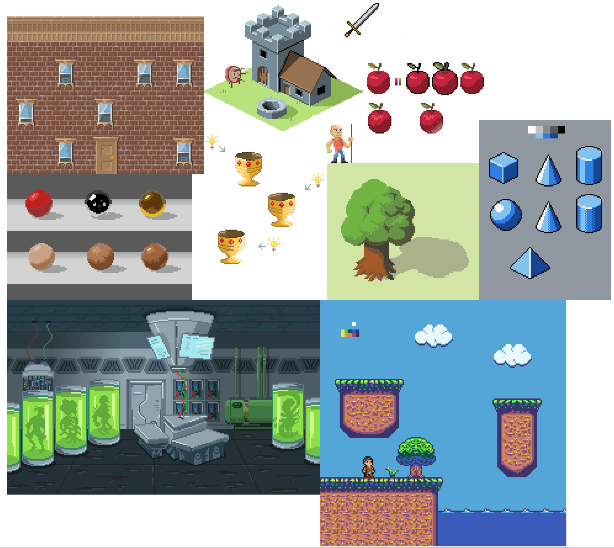

I decided to add diversity in everyday developers' life and last month I started to learn a new thing - pixel art.
It was long waiting goal, but finally I found time to invest in it (thanks you to all lockdowns, I guess). 

<!-- end -->

I don't have well-defined goal or plan for this.
I have some raw ideas in mind, will work on them in the upcoming months
Meanwhile, it brings me joy, and I will stick with it for a while.

By the way if you're interested I started to learn with this two courses:

* https://www.udemy.com/course/pixel-art-for-video-games/
* https://www.udemy.com/course/pixel-art-master-course/

Not sure which one is better, check out both of them :)

