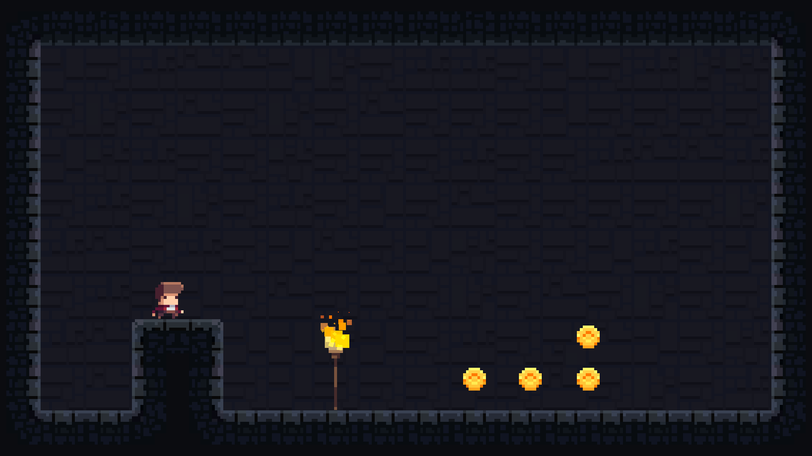

I started experimenting with game development. For now, it's a hobby, we'll see how it will go :)

<!-- end -->

After long consideration of what engine to use, I decided to start using Unity.
I'm still not 100% sure, will reconsider it after some time.
But for now it looks like the best available option for my needs.

I started with a very technical approach.
Currently, game doesn't have a name or story - only mechanics that I still need to develop.
Why is that? you ask. Well, good question. I wanted to separate concerns.
Inventing the story and writing the code, when both of these things are new to me is overwhelming.
I decided to concentrate on one thing and then improve the other.

If you're interested to follow the process, you should follow me on twitter [@artemdemo](https://twitter.com/artemdemo).
I regularly post new things there.
I'll also update the blog, but obviously it will take more time to do.

<video autoplay loop style="width: 100%">
  <source src="first-game-video.mp4" type="video/mp4" />
</video>
