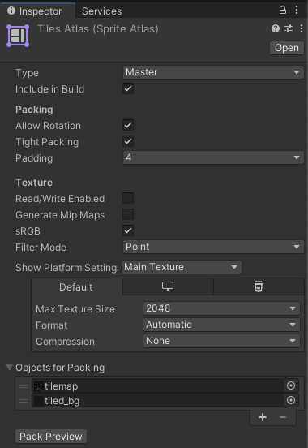

If you used tiles in your game, you know what I'm talking about.

Usually its white lines, but they can be of any color, and it can drive you crazy.
It looks like that the problem is related to how unity allocates tiles from your sprites.
While the camera moves in a scene the game engine rerender the scene and from time to time it doesn't draw exactly the tile at exactly the place.

IMO it's the result of optimizations on the unity side, but nevertheless we need a way to solve it.
I found two solutions: time-consuming one and optimal one.

**Option 1: Enlarge sprite tiles**

The time-consuming solution is to enlarge all your tiles by one pixel and slice them one pixel less.
Here is explanation on how to do it [https://www.youtube.com/watch?v=QW53YIjhQsA](https://www.youtube.com/watch?v=QW53YIjhQsA)

There is also free unity plugin for exactly that: [2D Tile Gap Fixing Tool](https://assetstore.unity.com/packages/2d/textures-materials/tiles/2d-tile-gap-fixing-tool-157060)

The second option is way simpler.

**Option 2: Use Sprite Atlas**

Second option will be to use Sprite Atlas. Just add it to your assets and drop in it your tileset.
Here is nice explanation of how to do it [https://www.youtube.com/watch?v=Wf98KrAyB2I](https://www.youtube.com/watch?v=Wf98KrAyB2I)

This is it.
